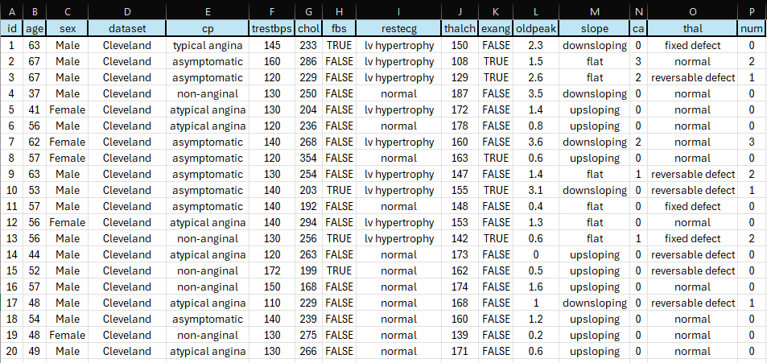

# FIAP - Faculdade de Informática e Administração Paulista

 

# Cap 1 - A Busca de Dados: Preparando o Terreno para a Inteligência Cardiológica

## Nome do grupo

# 👨‍🎓 Integrantes: 
- <a href="https://www.linkedin.com/in/renanmendes26/">Renan de Oliveira Mendes - RM563145</a>
- <a href="https://www.linkedin.com/company/inova-fusca">Nome do integrante 2</a>
- <a href="https://www.linkedin.com/company/inova-fusca">Nome do integrante 3</a> 
- <a href="https://www.linkedin.com/company/inova-fusca">Nome do integrante 4</a> 
- <a href="https://www.linkedin.com/company/inova-fusca">Nome do integrante 5</a>

# 📜 Descrição
Para essa entrega, buscamos e separamos diferentes tipos de dados.
Levantamos e organizamos dados cardiológicos que no futuro usaremos para alimentar os módulos inteligentes do CardioIA. Focando em governança de dados envolvendo IA.

Os tipos de dados:

1. Dados numéricos relacionados a pacientes cardíacos;
2. Textos médicos ou literários relacionados à saúde cardiovascular;
3. Imagens de raio-x do toráx.

Esses dados serão utilizados nas fases seguintes do projeto para alimentar algoritmos, treinar modelos de IA, fazer análises comparativas e gerar soluções inovadoras

## Dataset

Pegamos um conjunto de dados multivariado, envolvendo variáveis ​​matemáticas. O dataset é composto por:

- id - Identificador único de cada paciente.
- age -Idade do paciente em anos.
- origin - Local onde o estudo foi realizado.
- sex - Sexo do paciente (Masculino / Feminino).
- cp - Tipo de dor no peito.
- trestbps - Pressão arterial em repouso, medida na admissão hospitalar (mm Hg).
- chol - Nível de colesterol no sangue (mg/dl).
- fbs - Indica se o nível de glicose em jejum é maior que 120 mg/dl.
- restecg - Resultado do eletrocardiograma em repouso.
- thalach - Frequência cardíaca máxima atingida durante o teste.
- exang - Indica se o exercício físico provocou angina.
- oldpeak - Depressão do segmento ST causada por exercício em comparação com o estado de repouso.
- slope - Inclinação do segmento ST no pico do exercício.
- ca - Número de grandes vasos sanguíneos (0 a 3).
- thal - Resultado do exame de perfusão miocárdica (thalium test).
- num - Variável alvo do dataset. Indica a presença ou gravidade da doença cardíaca (resultado predito).

Fonte: https://www.kaggle.com/datasets/redwankarimsony/heart-disease-data
Criadores:
- Hungarian Institute of Cardiology. Budapest: Andras Janosi, M.D.
- University Hospital, Zurich, Switzerland: William Steinbrunn, M.D.
- University Hospital, Basel, Switzerland: Matthias Pfisterer, M.D.
- V.A. Medical Center, Long Beach and Cleveland Clinic Foundation: Robert Detrano, M.D., Ph.D.

Este banco de dados tem 76 atributos, mas todos os estudos publicados se referem ao uso de um subconjunto de 14 deles. O banco de dados de Cleveland é o único utilizado por pesquisadores de aprendizado de máquina até o momento. Uma das principais tarefas com este conjunto de dados é prever, com base nos atributos fornecidos de um paciente, se essa pessoa tem ou não doença cardíaca. Outra tarefa experimental é diagnosticar e obter diversas informações a partir deste conjunto de dados que possam ajudar a compreender melhor o problema.

Em estudos clínicos e em modelos de machine learning aplicados a cardiologia, as variáveis mais informativas costumam ser idade, que é um dos principais fatores de risco para doenças cardiovasculares.
Sintomas de dor torácica são fortemente associados à doença arterial coronariana. Trestbps (pressão arterial em repouso), hipertensão é um dos principais fatores de risco cardíaco e 
altos níveis de colesterol, que estão relacionados à formação de placas nas artérias.

Essas variáveis combinam fatores de risco, sintomas clínicos e exames cardiológicos, formando uma base adequada para treinar modelos de classificação de doença cardiovascular.

### Governança e Tratamento

Para utilizar o dataset em um projeto de Inteligência Artificial na área da saúde, precisamos aplicar algumas estratégias de governança e tratamento de dados para garantir qualidade e uso ético das informações.

Primeiramente, deve-se realizar a verificação e limpeza dos dados. Isso inclui identificar valores ausentes, inconsistências ou registros duplicados.
Padronização e normalização das variáveis.
Codificação de variáveis categóricas. Campos como sexo, tipo de dor no peito e resultados de exames precisam ser convertidos para formato numérico.

Do ponto de vista de governança, deve-se considerar o controle de viés e representatividade dos dados. É importante avaliar se há equilíbrio entre grupos demográficos, como sexo ou faixa etária, pois desequilíbrios podem levar a modelos que apresentem desempenho diferente para determinados grupos de pessoas.

Documentação da origem e das transformações dos dados. Registrar de onde o dataset foi obtido, quais variáveis foram utilizadas e quais etapas de limpeza e transformação foram aplicadas garantindo transparência.

Princípios de privacidade e anonimização, mesmo que o dataset já seja público. A ausência de dados pessoais identificáveis deve ser verificada.

# 📁 Estrutura de pastas

Dentre os arquivos e pastas presentes na raiz do projeto, definem-se:

- <b>.github</b>: Nesta pasta ficarão os arquivos de configuração específicos do GitHub que ajudam a gerenciar e automatizar processos no repositório.

- <b>assets</b>: aqui estão os arquivos relacionados a elementos não-estruturados deste repositório, como imagens.

- <b>config</b>: Posicione aqui arquivos de configuração que são usados para definir parâmetros e ajustes do projeto.

- <b>document</b>: aqui estão todos os documentos do projeto que as atividades poderão pedir. Na subpasta "other", adicione documentos complementares e menos importantes.

- <b>scripts</b>: Posicione aqui scripts auxiliares para tarefas específicas do seu projeto. Exemplo: deploy, migrações de banco de dados, backups.

- <b>src</b>: Todo o código fonte criado para o desenvolvimento do projeto ao longo das 7 fases.

- <b>README.md</b>: arquivo que serve como guia e explicação geral sobre o projeto (o mesmo que você está lendo agora).

